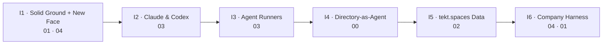

# tekt — Next Six Iterations (2026.09.14 → 2026.12.06)

Planned 2026.09.10 from the open GitHub issues plus the `.manage/` backlogs (`issues-agent-runners.md`, `issues-company-harness.md`). Every ticket carries a **layer label** from the arkitype spec (xingh/arkitype README → *arkitype*):

| Label | Arkitype layer | tekt layer(s) | Doc |
| --- | --- | --- | --- |
| `layer:00-arkitype` | 00 — how this instance is composed | catalog, archetypes, schemas, site profile | [00-arkitype.md](../00-arkitype.md) |
| `layer:01-infrastructure` | 01 — where and how it runs | tekt.dev, tekt.edge | [01-infrastructure.md](../01-infrastructure.md) |
| `layer:02-database` | 02 — where and how data is managed | tekt.base (+ tekt.spaces) | [02-database.md](../02-database.md) |
| `layer:03-software` | 03 — what processes run, for whom | tekt.iris | [03-software.md](../03-software.md) |
| `layer:04-interface` | 04 — what interfaces, for whom | tekt.cloud UIs, the `tekt` CLI, the tekt.md website | [04-interface.md](../04-interface.md) |

Iterations are two-week GitHub milestones. Arkitype builds bottom-up (01 → 04, with 00 describing the whole), so the plan goes the same way: first make the ground solid, then add runtimes, then formalize the composition, then the data layer, then the surfaces built on top. The tekt.md site facelift runs as a parallel 04 track in I1, because it is ready now.

---

## I1 · Solid Ground + New Face — 2026.09.14 → 09.27

**Goal:** the installers never print a false `[OK]`, and tekt.md looks like it belongs to the arkitype family.

| # | Issue | Layer |
| --- | --- | --- |
| #28 | Resolve winget errors on Windows install (`0x8a15000f` source preflight, real exit codes) | 01 · bug |
| #26 | Install GitHub CLI (`gh`) on all OSes and add it to the arkitype tekt.dev list | 01 |
| #33 | tekt.md site look & feel v2: arkitype blueprint theme | 04 |
| #34 | Render Mermaid diagrams with the blueprint theme | 04 · bug |
| #35 | Redraw tekt cover/body art in arkitype line-art style | 04 |

**Exit:** a clean Windows 11 VM run plus an Ubuntu run, with `status` all green. v2 site deployed on Netlify. Spec: `2026.09.10.site-look-and-feel.md`.

## I2 · Claude & Codex Everywhere — 09.28 → 10.11

**Goal:** the first-party agent clients install identically on every OS.

| # | Issue | Layer |
| --- | --- | --- |
| #24 | Claude Desktop on Linux (keyring → repo → update → install) | 03 |
| #25 | Validate Claude Desktop on Windows (`winget install Anthropic.Claude`) | 03 |
| #29 | Ensure Claude Desktop + Codex CLI install and report in status | 03 |

**Exit:** `claude`, Claude Desktop and `codex` show in `status` on macOS, Linux and Windows. The 03-software doc is updated.

## I3 · Agent Runner Expansion — 10.12 → 10.25

**Goal:** widen tekt.iris from 7 runtimes to 12, each following the same catalog → install.sh → install.ps1 → docs → README pattern.

| # | Issue | Layer |
| --- | --- | --- |
| #36 | opencode | 03 |
| #37 | crush | 03 |
| #38 | pi | 03 |
| #27 | OpenHands (Docker-staged, MCPHub-connected) | 03 |
| #32 | Devin | 03 |

**Exit:** every runner has an `upstream:` credit in `tekt.catalog.yaml` and a testing checklist ticked on at least two OSes.

## I4 · Directory-as-Agent — 10.26 → 11.08

**Goal:** make the composition itself declarative. An agent is a folder, and a company is a manifest.

| # | Issue | Layer |
| --- | --- | --- |
| #30 | Directory-as-agent: a folder layout that works in any language (`instructions.md`, `skills/`, `tools/`, `subagents/`, `schedules/` …) plus a runner | 00 · 03 |
| #40 | `company_harness` schema v1 + canonical manifest (Epics A3, B1) | 00 |
| #39 | Lift the SITE PROFILE (brand tokens, layers, taxonomy) into 00-arkitype | 00 |

**Exit:** the example agent folder runs under at least two tekt.iris runtimes, and the harness manifest validates and round-trips YAML ↔ Markmap ↔ Mermaid.

## I5 · tekt.spaces Data Layer — 11.09 → 11.22

**Goal:** workspaces and business data stay in sync and inspectable.

| # | Issue | Layer |
| --- | --- | --- |
| #31 | RcloneView for managing tekt.spaces connections (Windows, macOS, Linux) | 02 |
| #41 | Universal field protocol + sync engine (Epics D1, D2), mapped to Memory/Knowledge Engine | 02 |

**Exit:** a drift report between two nodes, and UFP adapters for company, contact, task, document and calendar_event.

## I6 · Company Harness Surfaces — 11.23 → 12.06

**Goal:** `tekt create company_harness --type saas` brings up a working business stack.

| # | Issue | Layer |
| --- | --- | --- |
| #42 | `tekt create company_harness` CLI + type selector (A1, A2, B3, E1) | 04 |
| #43 | App bundle catalog + one-command deploy: Coolify, NocoDB/Baserow, Filestash, Cal.com (C1–C3) | 04 · 01 |
| #44 | open-design studio with MCP integration | 04 |

**Exit:** `plan` → `apply` → `harness show` for the four company types, in dry-run at minimum.

**Stretch:** an "iteration board" page on tekt.md rendered from these milestones, styled like the arkitype `.manage/` panel.

---

## Not yet scheduled (next planning pass)

- Epic D3 (secrets and auth model), D4 (ops reliability pack), E2 and E3 (lifecycle docs, example harnesses) from `issues-company-harness.md`
- Installer CI smoke matrix (GitHub Actions: ubuntu, macos, windows running `install.* status`)
- Archive `issues-agent-runners.md` to `.archive/` once #36–#38 and #44 close
