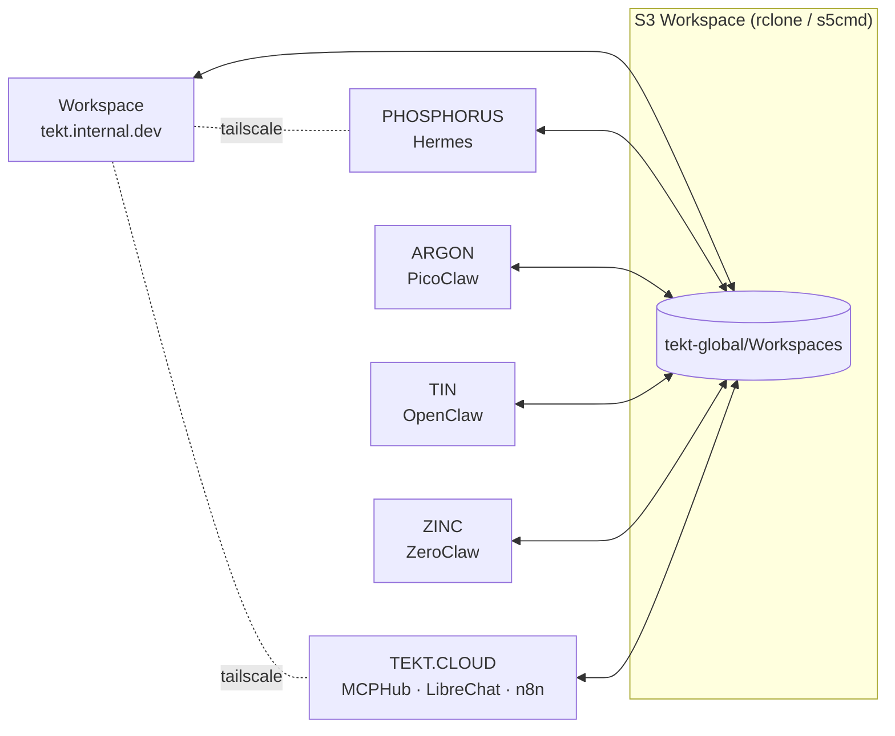

# 00 — Arkitype: Composing a Tekt Instance

An **arkitype** is the declarative composition of a Tekt instance: which components you install, which archetypal role the machine plays, and how it relates to the other nodes in your topology. It is what makes Tekt a *distribution* rather than a pile of install commands — the same way a Linux distro is defined by its package selection and defaults, a Tekt instance is defined by its arkitype.

An arkitype answers three questions:

1. **Composition** — which layers and tools are present (`tekt.dev`, `tekt.base`, `tekt.edge`, `tekt.iris`, `tekt.cloud`)
2. **Archetype** — what role this machine plays (Workspace, Agent Node, Edge Node, Cloud Node)
3. **Relationships** — how it syncs and talks to the rest of your mesh (S3 workspace sync, Tailscale network, MCP endpoints)

Arkitypes are stored as YAML (`tekt.catalog.yaml` carries the distribution-level defaults), rendered as Markdown outlines, and visualized as Markmap mindmaps or Mermaid diagrams — with round-trip editing between the three forms.

## The 00-arkitype section

Every Tekt instance can declare its own arkitype. The default shipped by this repo:

```yaml
arkitype:
  name: tekt.edge.default
  archetype: workspace          # workspace | agent | edge | cloud
  layers:
    tekt.dev:   full            # git, brew, go, python, node, vscode, docker
    tekt.base:  full            # rclone, aws-cli, s3cmd, s5cmd
    tekt.edge:  full            # tailscale, ngrok
    tekt.iris:  full            # ollama, claude-code, claude-desktop, zed,
                                # openclaw, picoclaw, hermes, zeroclaw, nanobot, nanoclaw
    tekt.cloud: staged          # mcphub + librechat + n8n scaffolded, started on demand
  workspace:
    root: ~/Tekt
    instance: ~/Tekt/Instances/${hostname}
    global_sync: s3://tekt-global/Workspaces   # via rclone / s5cmd
  mcp:
    hub: mcphub                 # samanhappy/mcphub on :3000
    servers: [filesystem, fetch, memory, github]   # the curated four — swap freely
    exposure: tailscale-serve   # tailscale-serve | ngrok | none
  interfaces:
    librechat: 3080
    n8n: 5678
    mcphub: 3000
```

## Schema archetypes: Memory Engine vs Knowledge Engine

To keep state design consistent across nodes, Tekt distinguishes two schema archetypes:

- **Memory Engine schema** — fast, local, mutable runtime memory for an agent/session (conversation turns, embeddings, recalls, short-lived working context).  
- **Knowledge Engine schema** — durable, normalized, shared knowledge structures (documents, entities, relationships, provenance, curation state).

Reference contract:

```yaml
schema_archetypes:
  memory_engine:
    scope: local-agent-or-session
    storage_defaults: [sqlite, vector-index, fts]
    write_pattern: high-frequency append/update
    retention: short-to-medium
    examples: [agent memories, session traces, transient recalls]
  knowledge_engine:
    scope: shared-workspace-or-org
    storage_defaults: [postgres, document-store, graph-shapes]
    write_pattern: curated ingest + revision
    retention: long-lived canonical records
    examples: [source registry, entity graph, validated insights]
```

## Archetypes

| Archetype | Description | Typical tools |
| --- | --- | --- |
| **Workspace** | Your primary machine — full dev environment, all agents, UIs on demand | Everything |
| **Agent Node** | A headless box running one agent runtime against the shared workspace | PicoClaw / ZeroClaw / Hermes + rclone |
| **Edge Node** | Low-resource or embedded — single-binary agents, local models optional | PicoClaw or ZeroClaw + Tailscale |
| **Cloud Node** | Hosts the shared services: MCPHub, LibreChat, n8n, Sovrant | Docker + tekt.cloud layer |

## Topology

The reference multi-machine topology connects a Workspace node with named agent nodes, all syncing bidirectionally through a central S3 bucket and reachable over a private Tailscale network:



## The signal flow

Whatever the topology, work moves through the same six phases, transforming object types along the way:

**Explore → Seek → Gather → Organize → Understand → Generate**

(Topics → Sources → Resources → Structures → Insights → Artifacts)

Agents pick up phases that suit their archetype: edge nodes gather, workspace nodes organize and understand, cloud nodes serve the interfaces where humans review and generate.

## Round-trip editing

- **YAML** is the canonical form — edit `arkitype:` blocks directly
- **Markmap** renders the same structure as an interactive mindmap for planning sessions
- **Mermaid** renders topology and flow diagrams for docs and study halls
- Changes in any rendered outline can be folded back into the YAML — the structure is intentionally flat enough that the mapping is mechanical

## Where to next

| Doc | Covers |
| --- | --- |
| [01 — Infrastructure](/01-infrastructure/) | Dev tooling, Docker, Tailscale, ngrok |
| [02 — Database](/02-database/) | rclone, S3 tools, MinIO, Postgres, Mongo |
| [03 — Software](/03-software/) | Agents, models, MCPHub + curated MCP servers |
| [04 — Interface](/04-interface/) | LibreChat, n8n, proxies, sharing from your home lab |

---

*Upstream credit is a founding principle of this distribution — see the `upstream:` field on every entry in [`tekt.catalog.yaml`](https://github.com/xingh/tekt.md/blob/main/tekt.catalog.yaml).*
