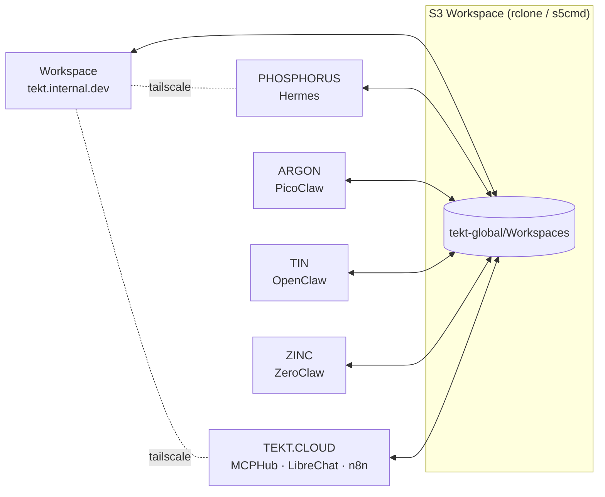

# 00 — Arkitype: Composing a Tekt Instance

An **arkitype** is the declarative composition of a Tekt instance: which components you install, which archetypal role the machine plays, and how it relates to the other nodes in your topology. It is what makes Tekt a *distribution* rather than a pile of install commands. A Tekt instance is defined by its arkitype: the components, defaults, and roles that fit it to the builders, operators, and managers who use it.

An arkitype answers three questions:

1. **Composition** — which layers and tools are present (`tekt.dev`, `tekt.base`, `tekt.edge`, `tekt.iris`, `tekt.cloud`)
2. **Archetype** — what role this machine plays (Workspace, Agent Node, Edge Node, Cloud Node)
3. **Relationships** — how it syncs and talks to the rest of your mesh (S3 workspace sync, Tailscale network, MCP endpoints)

Arkitypes are stored as YAML (`tekt.catalog.yaml` carries the distribution-level defaults), rendered as Markdown outlines, and visualized as Markmap mindmaps or Mermaid diagrams — with round-trip editing between the three forms.

## The 00-arkitype section

Every Tekt instance can declare its own arkitype. The default shipped by this repo:

```yaml
arkitype:
  name: tekt.edge.default
  archetype: workspace          # workspace | agent | edge | cloud
  layers:
    tekt.dev:   full            # git, gh, brew, go, python, node, vscode, docker
    tekt.base:  full            # rclone, aws-cli, s3cmd, s5cmd
    tekt.edge:  full            # tailscale, ngrok
    tekt.iris:  full            # ollama, claude-code, claude-desktop, zed,
                                # openclaw, picoclaw, hermes, zeroclaw, nanobot, nanoclaw
    tekt.cloud: staged          # mcphub + librechat + n8n scaffolded, started on demand
  workspace:
    root: ~/Tekt
    instance: ~/Tekt/Instances/${hostname}
    global_sync: s3://tekt-global/Workspaces   # via rclone / s5cmd
  mcp:
    hub: mcphub                 # samanhappy/mcphub on :3000
    servers: [filesystem, fetch, memory, github]   # the curated four — swap freely
    exposure: tailscale-serve   # tailscale-serve | ngrok | none
  interfaces:
    librechat: 3080
    n8n: 5678
    mcphub: 3000
```

## Schema archetypes: Memory Engine vs Knowledge Engine

To keep state design consistent across nodes, Tekt distinguishes two schema archetypes:

- **Memory Engine schema** — fast, local, mutable runtime memory for an agent/session (conversation turns, embeddings, recalls, short-lived working context).  
- **Knowledge Engine schema** — durable, normalized, shared knowledge structures (documents, entities, relationships, provenance, curation state).

Reference contract:

```yaml
schema_archetypes:
  memory_engine:
    scope: local-agent-or-session
    storage_defaults: [sqlite, vector-index, fts]
    write_pattern: high-frequency append/update
    retention: short-to-medium
    examples: [agent memories, session traces, transient recalls]
  knowledge_engine:
    scope: shared-workspace-or-org
    storage_defaults: [postgres, document-store, graph-shapes]
    write_pattern: curated ingest + revision
    retention: long-lived canonical records
    examples: [source registry, entity graph, validated insights]
```

## Archetypes

| Archetype | Description | Typical tools |
| --- | --- | --- |
| **Workspace** | Your primary machine — full dev environment, all agents, UIs on demand | Everything |
| **Agent Node** | A headless box running one agent runtime against the shared workspace | PicoClaw / ZeroClaw / Hermes + rclone |
| **Edge Node** | Low-resource or embedded — single-binary agents, local models optional | PicoClaw or ZeroClaw + Tailscale |
| **Cloud Node** | Hosts the shared services: MCPHub, LibreChat, n8n, Sovrant | Docker + tekt.cloud layer |

## Topology

The reference multi-machine topology connects a Workspace node with named agent nodes, all syncing bidirectionally through a central S3 bucket and reachable over a private Tailscale network:



## The signal flow

Whatever the topology, work moves through the same six phases, transforming object types along the way:

**Explore → Seek → Gather → Organize → Understand → Generate**

(Topics → Sources → Resources → Structures → Insights → Artifacts)

Agents pick up phases that suit their archetype: edge nodes gather, workspace nodes organize and understand, cloud nodes serve the interfaces where humans review and generate.

## Round-trip editing

- **YAML** is the canonical form — edit `arkitype:` blocks directly
- **Markmap** renders the same structure as an interactive mindmap for planning sessions
- **Mermaid** renders topology and flow diagrams for docs and study halls
- Changes in any rendered outline can be folded back into the YAML — the structure is intentionally flat enough that the mapping is mechanical

## PROFILE — the override layer

00-arkitype is the **override layer**. The layers below it (01 Infrastructure, 02 Database, 03 Software, 04 Interface) hold the core configuration in a standard structure that's the same for every Tekt. 00 holds what makes *this* one yours: its identity, look and settings. Clone the repo, change only this file, and you get a differently branded, differently configured Tekt, with the same structure underneath, so regenerating it stays predictable.

Everything instance-specific lives in one `profile:` block, with a section for each kind of thing being profiled. `site:` is the first; `agent:` and others can join it later (see [xingh/arkitype#12](https://github.com/xingh/arkitype/issues/12)).

- **Edit `profile.site` here** to change the site's name, tagline, colors, fonts, layers, navigation or install commands.
- `_data/site.json` is its **generated mirror**, because the site generator reads it. Don't edit it by hand. `npm run profile` rewrites it from this block, every `npm run build` (including the Netlify deploy) runs that first, and `npm run profile:check` fails if the two disagree.

```yaml
profile:
  site:
    name: tekt
    domain: tekt.md
    tagline: The utility belt for your AI harness.
    positioning: Easy AI at the edge for builders, operators and managers
    promise: One script installs it on machines you own, with keys you hold.
    why:
      not: Tekt isn't an agent, a model or a platform.
      does: >-
        It's the utility belt around them. Tekt manages the metadata, structure, processes and state of your harness,
        gets you started, and keeps your agents in sync through shared communications and knowledge tools. Every tool is
        pre-vetted and runs on your own infrastructure.
      items:
        - {k: Metadata, v: 'What''s installed, where, which version, and who made it', where: tekt.catalog.yaml}
        - {k: Structure, v: 'How machines, agents and tools fit together', where: arkitype layers 00 – 04}
        - {k: Processes, v: How agents hand work to each other and to people, where: MCPHub · n8n · LibreChat}
        - {k: State, v: One workspace and memory every agent can read and write, where: 'Spaces on Drive, OneDrive or Dropbox · memory MCP'}
    shelves:
      - kind: tool
        title: Tools
        status: shipping
        blurb: The toolchain, storage, network and UIs an AI stack stands on.
      - kind: agent
        title: Agents
        status: shipping
        blurb: Agent runtimes and clients, from Claude Code to single-binary edge agents.
      - kind: mcp
        title: MCP servers
        status: growing
        blurb: Tools your agents can call, served from one hub. Hand-picked additions land here.
      - kind: skill
        title: Skills
        status: growing
        blurb: Hand-curated, tested skills your agents load for one kind of job. Add one to a Space with tekt skill add.
      - kind: intelligence
        title: Intelligence
        status: bring-your-own
        catalogOnly: true
        blurb: Tekt ships no model and no keys. Point your agents at the provider you choose, by API or through the provider's own client.
    audiences:
      - id: builders
        verb: Build
        who: Builders
        gets: A ready AI sandbox for AI engineers. Toolchain, local models, agent runtimes and MCP tools arrive in one pass, so the first hour goes to your idea.
        cmd: bash install.sh && claude
        layers: ['01', '03']
      - id: operators
        verb: Run
        who: Operators
        gets: A stack you can keep running. Workspace sync, a private network, one status check, and HTTPS sharing in a single command.
        cmd: bash install.sh status
        layers: ['01', '02']
      - id: managers
        verb: Steer
        who: Managers
        gets: A clear view of the work. Chat and workflow UIs open in any browser, and a plain-language plan says what is installed and why.
        cmd: https://workspace.your-tailnet.ts.net
        layers: ['00', '04']
    pillars:
      - Sovereignty
      - Security
      - Privacy
    repo: https://github.com/xingh/tekt.md
    catalog_version: '2026.07'
    install:
      unix: curl -fsSL https://tekt.md/install.sh | bash
      windows: irm https://tekt.md/install.ps1 | iex
    brand:
      light:
        ground: '#F6F8FC'
        grid: '#E5EAF3'
        surface: '#FFFFFF'
        sunken: '#EEF2F8'
        ink: '#172033'
        muted: '#5A6579'
        line: '#CFD7E4'
        accent: '#6E56CF'
        link: '#2E6BF6'
      dark:
        ground: '#0B1220'
        grid: '#141D30'
        surface: '#101A2C'
        sunken: '#0D1627'
        ink: '#E4E9F3'
        muted: '#94A1B8'
        line: '#24324C'
        accent: '#A495F2'
        link: '#7AA2FF'
      fonts:
        display: Barlow Condensed
        body: IBM Plex Sans
        mono: IBM Plex Mono
    layers:
      - code: '00'
        slug: arkitype
        name: Arkitype
        tekt: composition
        url: /00-arkitype/
        color: '#6E56CF'
        color_dark: '#A495F2'
        blurb: 'What this instance is: layers, archetype, topology, signal flow.'
        tools: [tekt.catalog.yaml, archetypes, topology]
      - code: '01'
        slug: infrastructure
        name: Infrastructure
        tekt: tekt.dev · tekt.edge
        url: /01-infrastructure/
        color: '#56637A'
        color_dark: '#9AA7BF'
        blurb: 'Where it runs: dev toolchain, Docker, and the private mesh.'
        tools: [git, go, python, node, docker, tailscale, ngrok]
      - code: '02'
        slug: database
        name: Database
        tekt: tekt.base
        url: /02-database/
        color: '#0E8A8C'
        color_dark: '#3FC6C7'
        blurb: 'Where data lives: workspace sync, S3, and optional databases.'
        tools: [rclone, aws-cli, s5cmd, minio, postgres]
      - code: '03'
        slug: software
        name: Software
        tekt: tekt.iris
        url: /03-software/
        color: '#2E6BF6'
        color_dark: '#7AA2FF'
        blurb: 'What runs: local models, agent runtimes, MCP servers.'
        tools: [ollama, claude-code, openclaw, hermes, mcphub]
      - code: '04'
        slug: interface
        name: Interface
        tekt: tekt.cloud
        url: /04-interface/
        color: '#B8740E'
        color_dark: '#F0AE45'
        blurb: 'Who uses it: chat, workflows, proxies, sharing from your lab.'
        tools: [librechat, n8n, sovrant, tailscale serve]
    nav:
      - title: Home
        url: /
        sections: [{label: Who it's for, slug: who-its-for}, {label: Why it's different, slug: why-its-different}, {label: Bring your own intelligence, slug: bring-your-own-intelligence}, {label: Share with your people, slug: share-with-your-people}, {label: Roadmap, slug: roadmap}, {label: Quick Start, slug: quick-start}, {label: After the install, slug: after-the-install}, {label: Documentation path, slug: the-documentation-path}, {label: What gets installed, slug: what-gets-installed}, {label: Prerequisites, slug: prerequisites}, {label: Customizing, slug: customizing}, {label: Architecture, slug: architecture-reference}, {label: Troubleshooting, slug: troubleshooting}, {label: Credits, slug: credits}]
      - title: Catalog
        url: /catalog/
        sections: [{label: Tools, slug: tool}, {label: Agents, slug: agent}, {label: MCP servers, slug: mcp}, {label: Skills, slug: skill}, {label: Intelligence (bring your own), slug: intelligence}]
      - title: Spaces
        url: /spaces/
        sections: [{label: What a Space is, slug: what-a-space-is}, {label: Make your first Space, slug: make-your-first-space}, {label: Where it can live, slug: where-it-can-live}, {label: Invite people, slug: invite-people}, {label: Give your AI access, slug: give-your-ai-access}, {label: Tools & shared memory, slug: add-tools-and-shared-memory}, {label: Share skills, slug: share-skills}, {label: See them in a window, slug: see-your-spaces-in-a-window}, {label: Everyday commands, slug: everyday-commands}, {label: Troubleshooting, slug: troubleshooting}]
      - code: '00'
        title: Arkitype
        url: /00-arkitype/
        sections: [{label: The arkitype section, slug: the-00-arkitype-section}, {label: Schema archetypes, slug: schema-archetypes-memory-engine-vs-knowledge-engine}, {label: Archetypes, slug: archetypes}, {label: Topology, slug: topology}, {label: The signal flow, slug: the-signal-flow}, {label: Round-trip editing, slug: round-trip-editing}]
      - code: '01'
        title: Infrastructure
        url: /01-infrastructure/
        sections: [{label: Git, slug: 1-git}, {label: GitHub CLI, slug: github-cli-gh}, {label: Homebrew, slug: 2-homebrew-macoslinux}, {label: Go, slug: 3-go}, {label: Python, slug: 4-python-via-pyenv}, {label: Node.js, slug: 5-nvm-nodejs}, {label: VS Code, slug: 6-visual-studio-code}, {label: Docker, slug: 7-docker-docker-compose}, {label: .NET SDK, slug: 8-net-sdk}, {label: Tailscale, slug: 9-tailscale-private-mesh-network}, {label: ngrok, slug: 10-ngrok-instant-public-tunnels}, {label: Verify, slug: verify-the-layer}]
      - code: '02'
        title: Database
        url: /02-database/
        sections: [{label: Workspace layout, slug: workspace-layout}, {label: rclone, slug: 1-rclone-the-sync-backbone}, {label: AWS CLI / s3cmd / s5cmd, slug: 2-aws-cli-v2-s3cmd-s5cmd}, {label: MinIO, slug: 3-minio-your-own-s3-optional-but-sovereign}, {label: Postgres + pgvector, slug: 4-postgresql-pgvector-optional}, {label: Mongo + Meilisearch, slug: 5-mongodb-meilisearch-bundled-with-librechat}, {label: SQLite, slug: 6-sqlite-the-quiet-default}, {label: Verify, slug: verify-the-layer}]
      - code: '03'
        title: Software
        url: /03-software/
        sections: [{label: Local models (Ollama), slug: local-models}, {label: The claw family, slug: the-claw-family-friends}, {label: MCP servers & MCPHub, slug: mcp-servers-one-hub-four-locals-https-out}, {label: Sovrant, slug: sovrant-post-install-command-center}, {label: Verify, slug: verify-the-layer}]
      - code: '04'
        title: Interface
        url: /04-interface/
        sections: [{label: LibreChat, slug: 1-librechat-multi-model-chat-ui}, {label: n8n, slug: 2-n8n-workflow-automation}, {label: MCPHub dashboard, slug: 3-mcphub-dashboard}, {label: Reverse proxy, slug: 4-reverse-proxy-optional-one-hostname-for-everything}, {label: Sharing (HTTPS out), slug: 5-sharing-from-your-home-lab}, {label: Sovrant UX contract, slug: 6-sovrant-ux-contract-claude-like-ergonomics-current-palette}, {label: Study-hall checklist, slug: 7-study-hall-checklist}]
      - title: Downloads
        url: /install.sh
        sections: [{label: install.sh (Linux/macOS/WSL2), href: /install.sh}, {label: install.ps1 (Windows), href: /install.ps1}, {label: tekt.catalog.yaml (pins), href: /tekt.catalog.yaml}, {label: Changelog, href: /changelog/}]
```

## Where to next

| Doc | Covers |
| --- | --- |
| [01 — Infrastructure](/01-infrastructure/) | Dev tooling, Docker, Tailscale, ngrok |
| [02 — Database](/02-database/) | rclone, S3 tools, MinIO, Postgres, Mongo |
| [03 — Software](/03-software/) | Agents, models, MCPHub + curated MCP servers |
| [04 — Interface](/04-interface/) | LibreChat, n8n, proxies, sharing from your home lab |

---

*Upstream credit is a founding principle of this distribution — see the `upstream:` field on every entry in [`tekt.catalog.yaml`](https://github.com/xingh/tekt.md/blob/main/tekt.catalog.yaml).*
