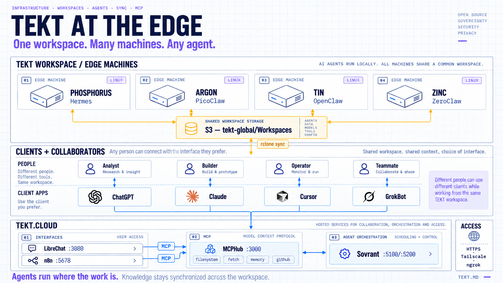
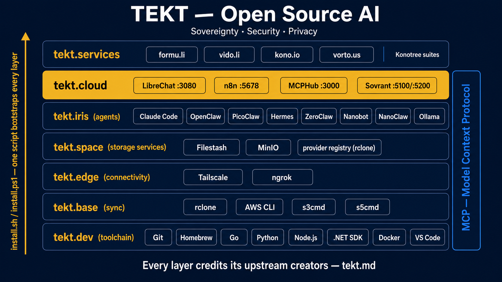

# Tekt — Bootstrap Open Source AI



**AI Sovereignty · Security · Privacy.** Tekt is an open distribution that bootstraps a complete AI engineering environment — dev tooling, workspace sync, local models, seven agent runtimes, an MCP server hub, and self-hosted chat & workflow UIs — on *your* hardware, with *your* keys, in a single script.




Tekt is a distribution, not a product: every component below is someone else's excellent work, credited explicitly. What Tekt adds is the composition — the [arkitype](/00-arkitype/) — and a bootstrap that gets an AI engineer from a blank machine to a working edge/cloud stack in one sitting.

---

## Quick Start

**Curl (macOS / Linux / WSL2):**

```
curl -fsSL https://tekt.md/install.sh | bash
```

**PowerShell (Windows):**

```
irm https://tekt.md/install.ps1 | iex
```

**Git:**

```
git clone https://github.com/xingh/tekt.md
cd tekt.md
bash install.sh          # or: .\install.ps1
```

**VirtualBox (pre-built VM):**

An OEM Linux Mint distribution by Rahul Singh with most prerequisites pre-installed. It boots in VirtualBox (or any compliant VM system) and walks you through setup like a brand-new computer.

- Install Oracle [VirtualBox](https://virtualbox.org)
- [Download the TEKT VM here](https://drive.google.com/file/d/1LG1PuvDKxfj-RyGCJ_iRCbnOPWe17fOL/view?usp=sharing)
- After initial setup:

```
cd ~/Tools/tekt.md
git pull
bash install.sh
```

**Supported platforms:** macOS (Intel + Apple Silicon), Ubuntu/Debian, Fedora/RHEL, Arch Linux, WSL2, Windows (PowerShell).

## After the install

```
bash install.sh status       # what landed, layer by layer
bash install.sh mcp          # MCPHub + 4 curated MCP servers → :3000
bash install.sh ui           # LibreChat → :3080, n8n → :5678
bash install.sh share 3080   # HTTPS-share a UI (Tailscale Serve, else ngrok)
bash install.sh catalog      # print the tool catalog
```

These subcommands are named so they read naturally when this script becomes the `tekt` CLI: `tekt status`, `tekt mcp`, `tekt ui`, `tekt share`.

---

## The Documentation Path

Five documents take you from composition to a shared, working home-lab stack:

| # | Doc | What it covers |
| --- | --- | --- |
| 00 | [Arkitype](/00-arkitype/) | The composition spec — layers, archetypes, topology, signal flow |
| 01 | [Infrastructure](/01-infrastructure/) | Git, Homebrew, Go, Python, Node, VS Code, Docker, **Tailscale, ngrok** |
| 02 | [Database](/02-database/) | rclone, AWS CLI, s3cmd, s5cmd, MinIO, Postgres+pgvector, workspace layout |
| 03 | [Software](/03-software/) | Ollama + the seven agents + **MCPHub with the curated MCP servers** |
| 04 | [Interface](/04-interface/) | LibreChat & n8n UIs, wiring them to MCP, proxies, sharing from your home lab |

## What Gets Installed

### Tekt.Dev — Development Environment

| Tool | Version | Purpose | Upstream |
| --- | --- | --- | --- |
| Git | latest | Version control — required first (Homebrew depends on it) | git-scm.com |
| Homebrew | 5.x | Package manager for macOS/Linux | Homebrew maintainers |
| Go | 1.26.2 | Runtime for Tekt-native tools | The Go Authors |
| Python | 3.14 via pyenv | Scripting, ML tooling, Python agents | PSF / pyenv contributors |
| nvm / Node.js | Node 24 LTS | JS runtime; OpenClaw & npm MCP servers | OpenJS / nvm contributors |
| VS Code | latest | Primary editor | Microsoft |
| Docker + Compose | latest | Runs the entire tekt.cloud layer | Docker, Inc. |

### Tekt.Base — Data, Storage & Sync

| Tool | Purpose | Upstream |
| --- | --- | --- |
| rclone | S3 & consumer-cloud workspace sync (Google Drive, OneDrive, …) | Nick Craig-Wood & contributors |
| AWS CLI v2 | Cloud storage & workspace management | Amazon Web Services |
| s3cmd | Batch S3 ops, alt providers (B2, R2, MinIO) | s3tools.org |
| s5cmd | Very fast parallel S3 transfers | Peak |
| MinIO *(optional)* | Self-hosted S3 — the sovereign bucket | MinIO, Inc. (AGPL) |

### Tekt.Edge — Network & Exposure

| Tool | Purpose | Upstream |
| --- | --- | --- |
| Tailscale | Private WireGuard mesh across your nodes; HTTPS via `tailscale serve` | Tailscale Inc. |
| ngrok | Instant public HTTPS tunnels for demos & webhooks | ngrok, Inc. |

### Tekt.Iris — Intelligence

| Tool | Purpose | Upstream |
| --- | --- | --- |
| Ollama | Local open-weight models — the sovereignty baseline | Ollama (MIT) |
| Claude Code | Agentic coding CLI | Anthropic |
| OpenClaw | Full agentic workspace runtime (Node) | OpenClaw contributors |
| PicoClaw | Single Go binary for $10 edge hardware | Sipeed |
| Hermes Agent | Self-improving agent + messaging gateway (no native Windows) | Nous Research |
| ZeroClaw | Rust runtime, <5MB RAM, ~10ms cold start | zeroclaw-labs contributors |
| Nanobot | Ultra-light Python agent with WebUI & MCP | HKUDS (MIT) |
| NanoClaw | Container-isolated agents on the Claude Agent SDK (staged; setup via Claude Code) | qwibitai (MIT) |

### Tekt.Cloud — Chat, Workflows & Command Center

Scaffolded by the installer, started on demand (`mcp` / `ui`):

| Tool | Port | Purpose | Upstream & license |
| --- | --- | --- | --- |
| MCPHub | 3000 | One hub aggregating your MCP servers into a single streamable-HTTP endpoint | samanhappy & contributors (Apache-2.0) |
| LibreChat | 3080 | Multi-model chat UI, MCP-connected | Danny Avila & contributors (MIT) |
| n8n | 5678 | Workflow automation, MCP client *and* server | n8n GmbH (Sustainable Use License — fair-code, **not OSI open source**) |
| Sovrant | 5100 / 5200 | .NET 10 command center for agents — desktop, web, OpenAI-compatible server, MCP server mode; the installer clones and builds it | Anant Corporation (**BSL 1.1** — source-available, not OSI open source; converts to Apache-2.0 on 2029-05-15) |

### The curated MCP servers

`bash install.sh mcp` brings up MCPHub with four local servers — **filesystem, fetch, memory, github** — working in your instance workspace (`~/Tekt/Instances/<host>/workspace`) and exposed at `http://localhost:3000/mcp`. Four is the default, not the limit: swap or add servers in `mcp_settings.json` (hot-reloaded), and put HTTPS in front with `bash install.sh share 3000`. Details: [03 — Software](/03-software/).

---

## Prerequisites

- **macOS:** Xcode Command Line Tools (`xcode-select --install`)
- **Linux:** `curl`, `sudo` access
- **Windows:** winget (App Installer); WSL2 recommended for full parity
- **All:** ~10 GB free disk, a reliable connection, and (optionally) API keys for hosted models — or none at all if you go all-local with Ollama

## Customizing

Version pins and repo URLs live in [`tekt.catalog.yaml`](https://github.com/xingh/tekt.md/blob/main/tekt.catalog.yaml) — edit it next to the script and both installers pick up the pins. To skip a tool, comment out its call in `main()`. The catalog is also the honest ledger of upstream creators and licenses; if you redistribute Tekt, keep it intact.

## Architecture Reference

```
Tekt/
├── Global/
│   └── Workspaces/              ← synced from S3 via rclone / s5cmd
└── Instances/
    └── <hostname>/
        ├── workspace/           ← what local agents & MCP servers see
        ├── mcp/                 ← MCPHub config + compose
        ├── cloud/               ← LibreChat / n8n / MinIO / Postgres stacks
        ├── agents/              ← NanoClaw and other source-staged agents
        └── sovrant/             ← command center (.NET 10 source build)
```

Full topology, archetypes, and signal flow: [00 — Arkitype](/00-arkitype/).

## Troubleshooting

The most common fix for everything: **restart your terminal** (PATH caching). Per-tool troubleshooting now lives in the doc for its layer — [01](/01-infrastructure/), [02](/02-database/), [03](/03-software/), [04](/04-interface/). Still stuck? `bash install.sh status` tells you exactly what's missing, and every install function prints its manual fallback commands when it fails.

## Contributing

Issues and PRs welcome at [github.com/xingh/tekt.md](https://github.com/xingh/tekt.md).

## Credits

Tekt exists because of the people who build the tools it composes. Every entry in `tekt.catalog.yaml` carries an `upstream:` field naming its creators — that field is load-bearing. Particular thanks to the maintainers of Git, Homebrew, Go, Python/pyenv, nvm/Node, VS Code, Docker, rclone, the AWS/S3 tool authors, Tailscale, ngrok, Ollama, Anthropic (Claude Code & the MCP reference servers), the OpenClaw community, Sipeed (PicoClaw), Nous Research (Hermes), zeroclaw-labs, HKUDS (Nanobot), qwibitai (NanoClaw), samanhappy (MCPHub), Danny Avila (LibreChat), and n8n GmbH.

---

*Maintained by [Anant Corporation](https://anant.us)*
